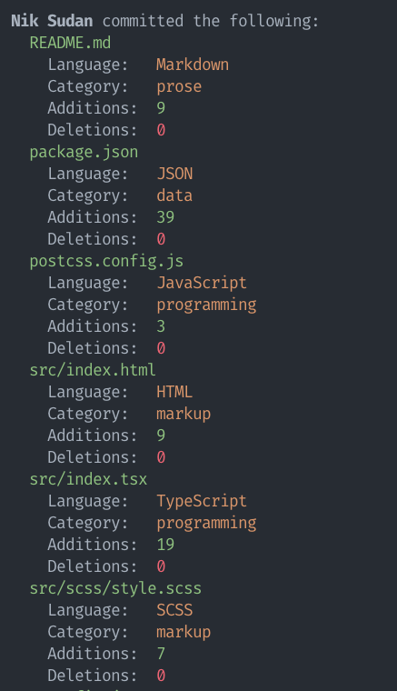

# devrpg

Turn source control into an RPG (work in progress).

Language data via [GitHub Linguist](https://github.com/github/linguist).

## CLI Installation

* `yarn`
* `yarn build`
* `yarn link`
* Run `devrpg` in any git repository
